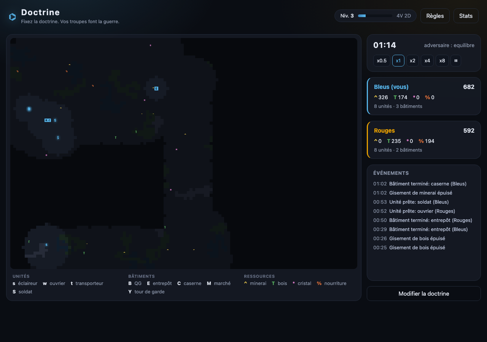
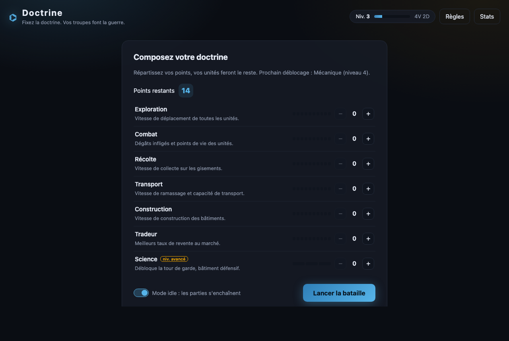
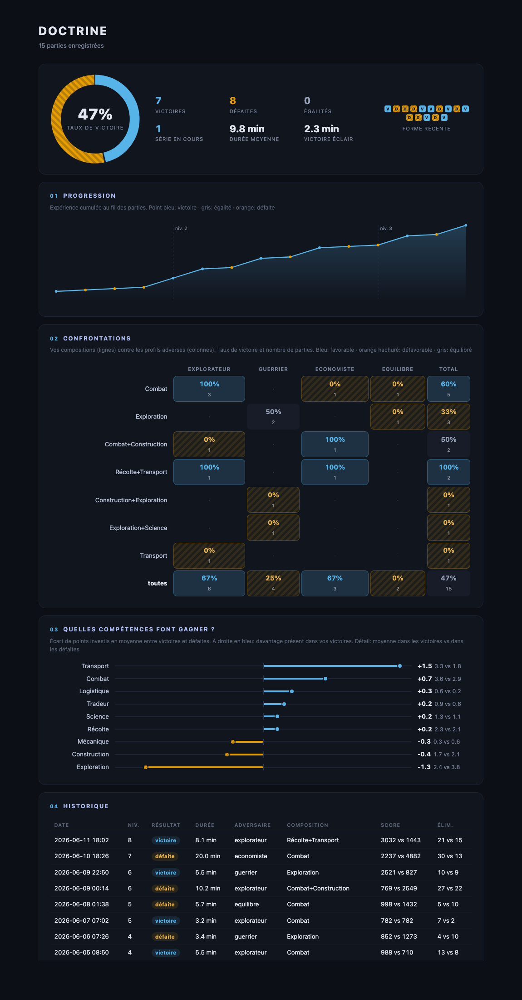

# Doctrine

Fixez la doctrine avant la bataille, vos troupes font la guerre.

Doctrine est un auto-battler stratégique inspiré des 4X. Deux équipes
s'affrontent sur une carte générée aléatoirement. Le joueur ne contrôle
pas ses unités : il répartit des points de compétences avant la partie,
puis ses armées explorent, récoltent, construisent et combattent de
manière autonome. Zéro dépendance : Python et sa bibliothèque standard,
avec une interface web et une interface terminal.



| Préparation | Statistiques |
| --- | --- |
|  |  |

## Installation

Aucune dépendance externe : Python 3.11 ou plus avec la bibliothèque
standard (curses est inclus sur macOS et Linux).

```sh
git clone <repo>
cd jeu-fable
python3 main.py
```

## Lancement

```sh
python3 main.py --web            # interface web (recommandé)
python3 main.py                  # interface terminal (curses)
python3 main.py --seed 42        # rejouer une carte identique
python3 main.py --headless       # simulation IA contre IA (équilibrage)
python3 main.py --headless --games 10 --seed 100
python3 main.py --level 5        # tester un niveau sans toucher au profil
python3 main.py --stats          # ouvrir la page web de statistiques
```

L'interface web sert le jeu sur http://127.0.0.1:8765 (option `--port`) :
configuration de la doctrine, carte en temps réel, popup de règles et
mode idle où les parties s'enchaînent automatiquement, même navigateur
fermé. En terminal, la fenêtre doit faire au moins 80x24. La progression
est sauvegardée dans `profile.json` à la racine du projet (option
`--profile` pour un autre chemin), l'historique des parties dans
`history.json`.

## Règles du jeu

### Préparation

Avant chaque partie, vous disposez d'un budget de points (10 au niveau 1,
plus 2 par niveau) à répartir entre vos compétences. L'adversaire répartit
les siens selon une stratégie tirée au hasard (guerrier, économiste,
explorateur ou équilibré). La répartition est remise à zéro à chaque
partie : seuls le niveau et l'expérience sont persistants.

### Compétences de base

* Exploration : vitesse de déplacement des unités
* Combat : dégâts infligés et points de vie
* Récolte : vitesse de collecte sur les gisements
* Transport : vitesse de ramassage et capacité de transport
* Construction : vitesse de construction des bâtiments
* Tradeur : meilleurs taux de revente au marché

### Compétences débloquées par niveau

* Science (niveau 2) : débloque la tour de garde
* Mécanique (niveau 3) : réparation automatique près des bâtiments
* Logistique (niveau 4) : transporteurs plus rapides
* Espionnage (niveau 5) : révèle ponctuellement des zones adverses
* Fortification (niveau 6) : points de vie des bâtiments augmentés
* Cartographie (niveau 7) : rayon de vision augmenté
* Conscription (niveau 8) : soldats formés plus vite
* Pillage (niveau 9) : chaque ennemi éliminé rapporte des ressources
* Frénésie (niveau 10) : cadence d'attaque augmentée

### Déroulement

Les unités explorent, récoltent, transportent, construisent et combattent
seules. Les ouvriers extraient les ressources et les empilent sur les
gisements, les transporteurs font la navette vers la base, les éclaireurs
lèvent le brouillard de guerre, les soldats défendent la base puis
attaquent dès qu'une escouade de trois est constituée.

L'équilibrage repose sur des contres : les soldats au delà de trois
consomment de la nourriture (la famine frappe les armées sans économie),
les soldats d'élite coûtent plus cher, les troupes loin de leurs
bâtiments subissent une attrition (atténuée par la logistique), les
défenseurs frappent plus fort près de leur QG et les ouvriers réparent
les bâtiments assiégés (la construction est aussi une statistique
défensive). Aucune doctrine ne domine toutes les autres.

La partie se gagne en détruisant le QG adverse. Au bout de 20 minutes,
l'équipe au meilleur score (stocks, unités, bâtiments, exploration)
l'emporte. Une victoire rapporte 100 points d'expérience, une égalité 40,
une défaite 15.

En fin de partie, un récapitulatif compare les deux équipes (zones
explorées, ressources récoltées, unités formées, perdues et éliminées,
bâtiments, dégâts). Une touche relance directement une nouvelle partie,
`q` quitte.

### Statistiques

Chaque partie est archivée dans `history.json` et la page `stats.html`
est régénérée automatiquement : taux de victoire, série en cours,
résultats par profil adverse et par composition jouée, points investis
en moyenne dans les victoires contre les défaites, historique détaillé.
`python3 main.py --stats` l'ouvre dans le navigateur.

### Unités

| Symbole | Unité        | Rôle                                   |
| ------- | ------------ | -------------------------------------- |
| `s`     | éclaireur    | explore la carte                       |
| `w`     | ouvrier      | récolte et construit                   |
| `t`     | transporteur | ramène les récoltes à la base          |
| `S`     | soldat       | défend puis attaque                    |

### Bâtiments

| Symbole | Bâtiment      | Effet                                  |
| ------- | ------------- | -------------------------------------- |
| `B`     | QG            | dépôt, forme les unités                |
| `E`     | entrepôt      | dépôt avancé près des gisements        |
| `C`     | caserne       | forme les soldats plus vite            |
| `M`     | marché        | vend le surplus contre de la nourriture|
| `Y`     | tour de garde | tire sur les ennemis proches (science) |

### Ressources et terrain

| Symbole | Élément    | Couleur  |
| ------- | ---------- | -------- |
| `^`     | minerai    | jaune    |
| `T`     | bois       | vert     |
| `*`     | cristal    | magenta  |
| `%`     | nourriture | rouge    |
| `.`     | plaine     |          |
| `"`     | forêt      | verte    |
| `#`     | montagne   |          |
| `~`     | eau        | cyan, infranchissable |

Votre équipe est bleue, l'adversaire est rouge.

### Touches

* flèches : déplacer la vue sur la carte
* `b` : recentrer la vue sur votre base
* `p` : pause
* `+` / `-` : vitesse de simulation
* `l` : afficher ou masquer la légende
* `q` : quitter

## Architecture

* `engine/` : simulation pure (carte, unités, économie, combat, IA),
  sans aucune dépendance au rendu
* `render/` : affichage curses, viewport, légende
* `meta/` : compétences (déclaratives), progression et sauvegarde JSON
* `main.py` : ligne de commande, écrans et boucle temps réel
* `tests/` : tests unitaires du moteur

Ajouter une compétence se fait en ajoutant une entrée dans
`meta/skills.py` et en la lisant depuis un multiplicateur de `Team`.

```sh
python3 -m unittest discover -s tests   # lancer les tests
```
